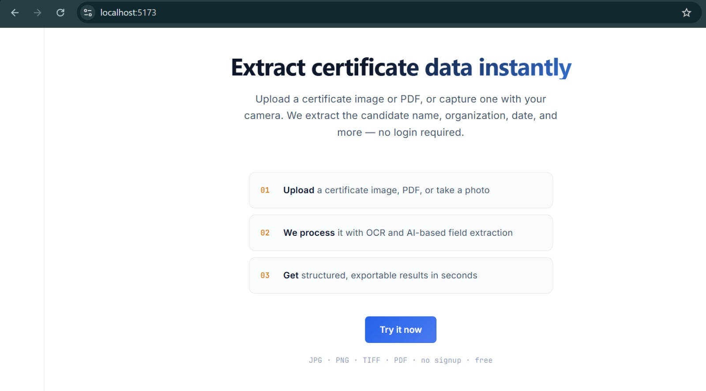
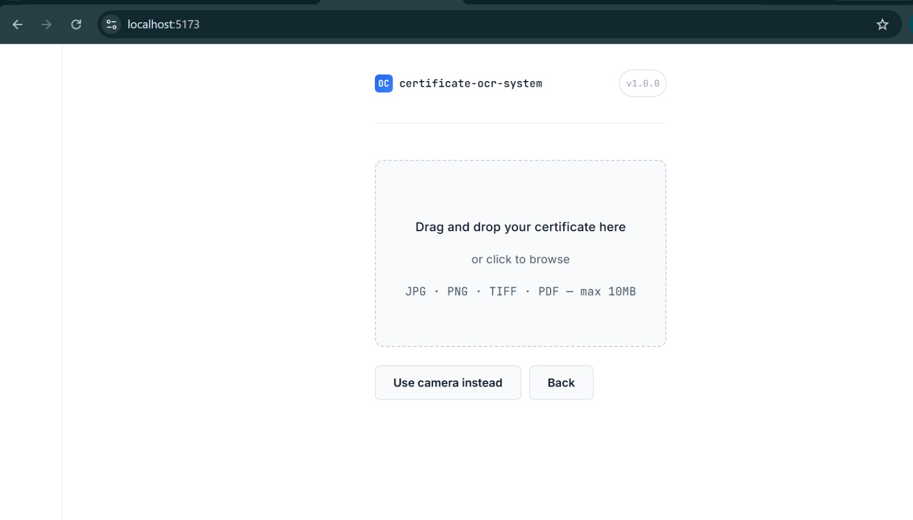
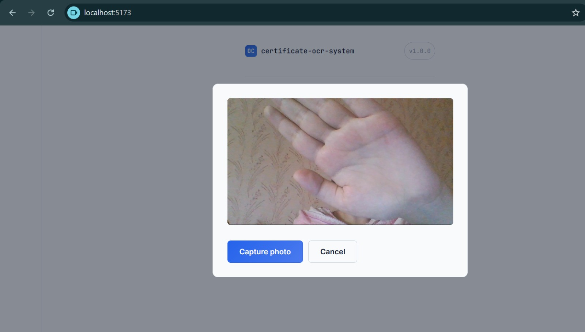
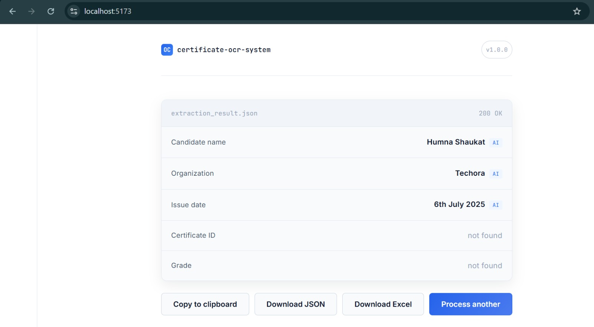

# Certificate OCR System

A web application that automatically extracts structured information — candidate name, organization, issue date, certificate ID, and grade — from certificate images and PDFs, using Tesseract OCR with an AI-assisted extraction fallback.

Built for the Teerop Pvt. Limited Gen AI & LLM Applications Internship Program, Task 1.

## Overview

Certificate OCR System automates a process that traditionally takes 5–10 minutes of manual data entry per certificate. Upload a photo, scan, or PDF of a certificate, and the system extracts and structures the key fields in under 30 seconds.

The system uses a **hybrid extraction pipeline**: fast, deterministic regex pattern-matching runs first, and a Groq-hosted LLM (`llama-3.1-8b-instant`) fills in fields the regex pass couldn't confidently extract — particularly useful for stylized logos, noisy OCR output, and non-standard certificate layouts.

## Features

- Drag-and-drop or click-to-browse file upload (JPG, PNG, TIFF, PDF)
- Live camera capture (desktop and mobile, via `getUserMedia`)
- Image preprocessing pipeline: orientation correction, grayscale conversion, denoising, adaptive thresholding, and deskewing
- Multi-page PDF support
- Hybrid regex + LLM field extraction, with per-field source labeling (`regex` vs `llm`)
- Copy to clipboard, JSON export, and Excel export of results
- Full error handling with clear, user-facing messages (no raw stack traces exposed)

## Screenshots

**Landing page**


**Upload interface**


**Camera capture**


**Extraction results**


## Tech stack

**Backend:** Python, FastAPI, Tesseract OCR (via pytesseract), OpenCV, pdf2image, Groq API

**Frontend:** React (Vite), Axios, SheetJS (xlsx)

## Project structure

```
teerop_1/
├── app/
│   ├── core/
│   │   ├── ocr_engine.py       # Tesseract integration, PDF handling
│   │   ├── preprocessor.py     # OpenCV image preprocessing pipeline
│   │   ├── extractor.py        # Regex-based structured field extraction
│   │   └── llm_extractor.py    # LLM-based extraction fallback (Groq)
│   └── utils/
│       └── file_handler.py     # Upload validation and secure file storage
├── frontend/                   # React (Vite) application
├── sample_certificates/        # Test certificate images
├── tests/
│   └── generate_sample.py      # Generates a synthetic test certificate
├── uploads/                    # Temporary storage (cleared after processing)
├── main.py                     # FastAPI application entry point
└── requirements.txt
```

## Installation

### Prerequisites

- Python 3.11+
- Node.js 18+
- [Tesseract OCR](https://github.com/UB-Mannheim/tesseract/wiki) installed and on PATH
- [Poppler](https://github.com/oschwartz10612/poppler-windows) installed and on PATH (required for PDF support)
- A [Groq API key](https://console.groq.com) (optional — enables the AI extraction fallback; the app runs without one using regex extraction only)

### Backend setup

```bash
python -m venv venv
venv\Scripts\activate        # Windows
source venv/bin/activate     # macOS/Linux

pip install -r requirements.txt
```

Create a `.env` file in the project root:
GROQ_API_KEY=your_groq_api_key_here

Run the server:
```bash
uvicorn main:app --reload
```

The API will be available at `http://127.0.0.1:8000`. Interactive API docs at `http://127.0.0.1:8000/docs`.

### Frontend setup

```bash
cd frontend
npm install
npm run dev
```

The app will be available at `http://localhost:5173`.

## API documentation

### `GET /health`
Health check. Returns `{"status": "ok", "service": "certificate-ocr-system"}`.

### `POST /extract`
Accepts a single file upload (`multipart/form-data`, field name `file`). Returns structured extraction results.

**Example response:**
```json
{
  "success": true,
  "data": {
    "candidate_name": "Humna Shaukat",
    "organization": "Techora",
    "issue_date": "6th July 2025",
    "certificate_id": null,
    "grade": null,
    "raw_text": "...",
    "candidate_name_source": "llm",
    "organization_source": "llm"
  }
}
```

Fields the LLM filled in (rather than regex) are marked with a `<field>_source: "llm"` key, for transparency.

## Scope

This system is purpose-built for **certificates** — the field extraction logic (regex patterns and the LLM prompt) is tuned to certificate language ("this certifies that...", "presented to...", issuing organization headers, etc.). The underlying OCR will run on any image, but structured field extraction is only reliable on certificate-style documents.

## Known limitations

- **Handwritten fields** (e.g. handwritten dates or signatures) are extracted with reduced accuracy, since Tesseract is optimized for printed text, not handwriting recognition.
- **Heavily stylized or low-contrast certificates** (colorful gradient backgrounds, decorative fonts, colored text on colored backgrounds) reduce OCR accuracy, as text-background contrast is a fundamental constraint of OCR engines.
- **Organization name extraction** uses a confidence cascade (explicit labels → legal/institutional suffixes → capitalization heuristics → positional fallback) rather than a single reliable rule, since organization names appear in highly inconsistent positions and formats across certificate designs.
- The system corrects 90°/180°/270° image rotation automatically, but does not correct arbitrary skew beyond the built-in deskewing step.

## Security notes

- Uploaded files are validated by MIME type (not filename extension) and size-limited to 10MB.
- Uploaded files are renamed to random UUIDs on disk to prevent path traversal; original filenames are never trusted.
- Files are deleted from the server immediately after processing.
- The `xlsx` (SheetJS) npm package has known CVEs related to *parsing* untrusted spreadsheet files; this project only *writes* Excel files from data it already controls and never parses uploaded spreadsheets, so this does not apply here.

## Testing

```bash
python tests/generate_sample.py   # generates a synthetic test certificate
python -m pytest tests/           # run test suite
```

## Author

Humna Shaukat — BS Artificial Intelligence, National University of Technology (NUTECH), Islamabad